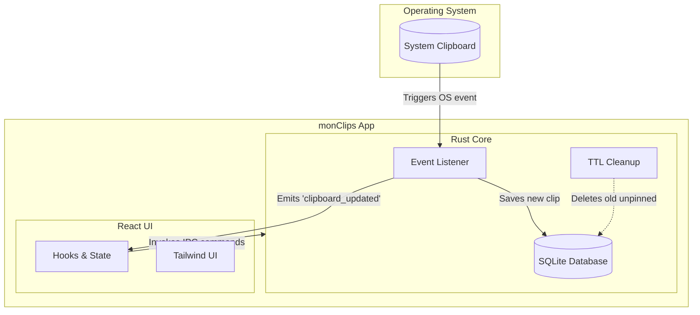

# monClips 📋✨


**monClips** is a blazing-fast, lightweight desktop clipboard manager built with Tauri. It captures everything you copy, saves it securely to a local database, allows you to pin essential items, and automatically cleans up unpinned clutter after 24 hours.

## 🚀 Features

- **Invisible Monitoring:** Hooks directly into OS-level clipboard events. Zero CPU overhead when idle.
- **Local First:** All your data lives locally on your machine in a snappy SQLite database. No cloud, no tracking.
- **Pin & Preserve:** Pin important clips to keep them forever and keep them at the top of your list.
- **Auto-Cleanup (TTL):** Unpinned clips are automatically purged after 24 hours to keep your history clean and respect your privacy.
- **Smart Links:** Automatically detects URLs in your clipboard history and allows you to open them directly in your default browser.
- **Cross-Platform:** Available and native-feeling on macOS, Ubuntu (Linux), and Windows.

## 🏗️ Architecture

monClips uses a **"Thick Backend"** architecture, separating concerns between a highly performant system layer and a reactive UI layer.



📚 **Deep Dives:**
- [Frontend Documentation (React, Hooks, UI)](docs/FRONTEND.md)
- [Backend Documentation (Rust, SQLite, OS Events)](docs/BACKEND.md)

## 🛠️ Installation & Setup

To run this project locally, you will need **Node.js** and the **Rust Toolchain**.

### 1. OS-Specific Prerequisites

**🍎 macOS**
```bash
# Install Xcode Command Line Tools
xcode-select --install
```

**🐧 Ubuntu / Debian Linux**
You need the necessary libraries to render the Tauri WebView.
```bash
sudo apt update
sudo apt install libwebkit2gtk-4.1-dev \
  build-essential \
  curl \
  wget \
  file \
  libxdo-dev \
  libssl-dev \
  libayatana-appindicator3-dev \
  librsvg2-dev
```

**🪟 Windows**
Download and install the [C++ Build Tools for Visual Studio 2022](https://visualstudio.microsoft.com/visual-cpp-build-tools/). Ensure "Desktop development with C++" is selected. Alternatively, you can use the winget command: `winget install Microsoft.VisualStudio.2022.BuildTools`.

### 2. General Setup

Make sure you have Rust installed via `rustup`:
```bash
curl --proto '=https' --tlsv1.2 -sSf https://sh.rustup.rs | sh
```

Clone the repository and install dependencies:
```bash
git clone https://github.com/yourusername/Ubuntu-monClips.git
cd Ubuntu-monClips
npm install
```

### 3. Run for Development

Start the app in development mode with Hot-Module Replacement (HMR):
```bash
npm run tauri dev
```

### 4. Build for Production

Compile the app into a native executable for your current OS (`.dmg` for Mac, `.deb`/`AppImage` for Linux, `.msi` for Windows):
```bash
npm run tauri build
```
The installers will be located in `src-tauri/target/release/bundle/`.

## 📜 License
MIT License.
