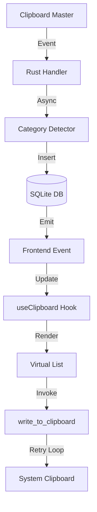

# 📝 Registro de Desenvolvimento — 2026-04-29

**Escopo:** Refatoração do sistema de Clipboard, Categorias e UI
**Commits gerados:** 4
**Arquivos modificados:** 14

---

## 1. Visão Geral das Alterações

Nesta sessão, restauramos a funcionalidade de identificação de categorias para os clips, corrigimos a instabilidade na cópia para o clipboard em sistemas Linux/Wayland e modernizamos a interface com virtualização de listas e notificações em tempo real.

---

## 2. Arquitetura Afetada

O fluxo de dados foi otimizado para evitar bloqueios na thread principal do Rust e melhorar a responsividade do React.

---

## 3. Mapa de Arquivos Modificados

| Arquivo | Tipo | O que mudou |
|--------|------|-------------|
| `src-tauri/src/db.rs` | Logic | Adição de categorias, migração e índices. |
| `src-tauri/src/lib.rs` | Commands | Comando async de escrita com retries e atalho global. |
| `src/hooks/useClipboard.ts` | Hook | Suporte a paginação, categorias e toasts. |
| `src/App.tsx` | View | UI completa com virtualização e design polido. |
| `src-tauri/Cargo.toml` | Config | Adição de plugins Tauri v2. |

---

## 4. Detalhamento por Commit

### `chore: atualiza dependências e capacidades do Tauri`
**Razão da alteração:** Necessidade de suporte a atalhos globais e virtualização no frontend.
**Arquivos envolvidos:** `package.json`, `Cargo.toml`, `capabilities/default.json`.

### `feat(db): adiciona suporte a categorias e otimizações de busca`
**Razão da alteração:** Restaurar a identificação do tipo de conteúdo (URL, Code, etc) que havia sido perdida.
**Decisões técnicas:** Implementada migração automática via `ALTER TABLE` para evitar perda de dados.

### `fix(clipboard): melhora confiabilidade da escrita no clipboard`
**Razão da alteração:** Cópia falhava silenciosamente em alguns ambientes Linux.
**Decisões técnicas:** Adicionado loop de 3 tentativas com 100ms de intervalo para garantir que o recurso de clipboard esteja disponível.

### `feat(ui): implementa interface moderna com virtualização e categorias`
**Razão da alteração:** Melhorar performance com muitos itens e polir a experiência visual.
**Decisões técnicas:** Uso de `@tanstack/react-virtual` para renderizar apenas itens visíveis.

---

## 5. ✅ O Que Está Funcionando

- [x] Detecção automática de URLs, Códigos e Cores.
- [x] Atalho global `Alt + C` para exibir a janela.
- [x] Scroll infinito e virtualização de lista.
- [x] Cópia confiável com sistema de retries.

---

## 6. ❌ O Que Está Pendente

- `[ ]` Preview de imagens — *necessário implementar suporte a blobs no banco de dados.*
- `[ ]` Edição manual de categorias.

---

## 7. ⚠️ Dívida Técnica Identificada

- **Lógica de Categorias:** O detector é baseado em heurísticas simples de string; pode ser melhorado com regex mais robustos.
- **SQLite Sync:** O uso de `Mutex<Connection>` bloqueia a thread quando o monitor de clipboard e a UI tentam acessar o banco simultaneamente. Considerar `r2d2` ou `sqlx` futuramente.

---

## 8. Padrões Importantes a Lembrar

- **Conventional Commits:** Seguir o padrão de prefixos em PT-BR para clareza da equipe.
- **Async Commands:** Comandos Tauri que interagem com IO externo (clipboard, rede) devem ser `async`.

---

## 9. Próximos Passos

1. Implementar sistema de "Limpeza de Histórico" configurável.
2. Adicionar suporte a temas (Claro/Escuro) selecionáveis pelo usuário.
3. Melhorar o suporte a múltiplos monitores no foco da janela.
