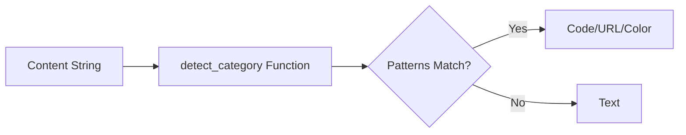

# 📝 Registro de Desenvolvimento — 2026-04-29

**Escopo:** Melhoria na Detecção de Categorias (Heurísticas de Código)
**Commits gerados:** 1
**Arquivos modificados:** 1

---

## 1. Visão Geral das Alterações

Aprimoramos o algoritmo de detecção automática de categorias para identificar snippets de código com maior precisão. Anteriormente, o detector era limitado a poucas palavras-chave; agora ele abrange uma gama maior de linguagens e padrões sintáticos comuns.

---

## 2. Arquitetura Afetada

O componente de lógica do banco de dados (`db.rs`) foi o único afetado, especificamente a função pura de detecção.

---

## 3. Mapa de Arquivos Modificados

| Arquivo               | Tipo  | O que mudou                                     |
| --------------------- | ----- | ----------------------------------------------- |
| `src-tauri/src/db.rs` | Logic | Expansão das heurísticas de detecção de código. |

---

## 4. Detalhamento por Commit

### `feat(db): melhora heurísticas de detecção de código`

**Razão da alteração:**
Alguns snippets de código (especialmente Rust e JS moderno) estavam sendo classificados genericamente como "Text".

**O que faz agora:**
Identifica palavras-chave como `pub`, `use`, `struct`, `async`, `await` e símbolos como `=>`, `);` ou `];` para classificar o conteúdo como "Code".

**Decisões técnicas:**
Utilizada uma lista estática de indicadores (`code_indicators`) para manter a performance da função de detecção, que é executada em cada nova entrada no clipboard.

---

## 5. ✅ O Que Está Funcionando

- [x] Detecção de Rust (`fn`, `pub`, `struct`, `println!`).
- [x] Detecção de JavaScript/TypeScript (`const`, `let`, `=>`, `console.log`).
- [x] Detecção de C/C++ (`#include`, `printf`, `std::`).
- [x] Classificação correta de URLs e Cores Hex.

---

## 6. ❌ O Que Está Pendente

- `[ ]` Detecção baseada em extensões de arquivo (se o clip vier de um editor).
- `[ ]` Suporte a Markdown.

---

## 7. ⚠️ Dívida Técnica Identificada

- **Falsos Positivos:** Palavras como "class" ou "private" em um texto comum podem disparar a detecção de código. O ideal seria uma análise estatística ou baseada em tokens, mas as heurísticas atuais são um bom compromisso entre velocidade e precisão.

---

## 8. Próximos Passos

1. Validar a detecção com snippets de outras linguagens (Python, Go, PHP).
2. Adicionar suporte a detecção de caminhos de arquivos (File Paths).
